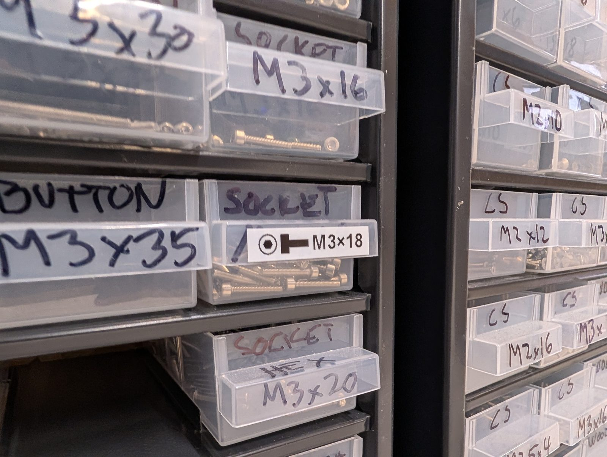
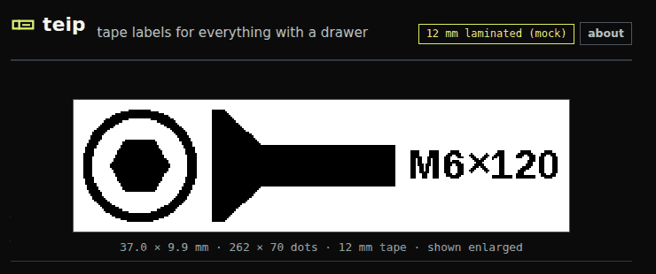
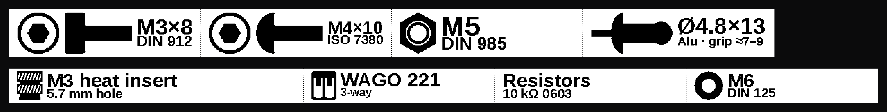

  

<h1 align="center">teip</h1>

<b>Tape labels for everything with a drawer.</b> 
Design a label for a bin, box or drawer in your browser and print it on a Brother TZe label printer.

  
   Before and after: Sharpie on the drawers around it, teip in the middle.

## What it is

A small web app for labelling bins, assortment boxes, drawers and shelves. Pick what's inside,
type the size, and print:

- **Labels you can read at a glance.** Screw drive and head, nuts, washers, rivets, inserts or
  your own icons, next to one or two lines of text.
- **A whole drawer at once.** Queue labels and print one strip with half cuts between them, so
  they peel off one by one and you waste tape once, not once per label.
- **Sized for the box.** Fit to the text, a length in mm, or Gridfinity grid units.
- **Runs where you want.** Straight from Chrome or Edge with the printer plugged into your
  computer, or on a Raspberry Pi next to the printer so any phone on the network can print.

> [!WARNING]
> **Early days, and mostly untested.** teip has printed real labels on one printer, a PT-E560BT
> over USB, both through the teip server and straight from Chrome. Other printers, Bluetooth and
> the Raspberry Pi installer are written but not yet tried on hardware. See [which printers](docs/printers.md).

## Get started

- **Try it in the browser:** open **[petrepa.com/teip](https://petrepa.com/teip/)** in Chrome or Edge, plug in the printer (USB or Bluetooth) and press Connect. Nothing to install; design works in any browser, printing needs Chrome or Edge.
- **Raspberry Pi:** `git clone https://github.com/petrepa/teip && cd teip && ./deploy/linux/install.sh --hostname teip`, then open http://teip.local/
- **Windows, or more detail:** [docs/install.md](docs/install.md)

More: [using teip](docs/using.md) · [printers](docs/printers.md) · [protocol and HTTP API](docs/PROTOCOL.md)

## Contributing

**Contributions are very welcome.** Tried teip on your printer? A
[printer report](https://github.com/petrepa/teip/issues/new?template=printer-report.yml) helps
most, working or not. New icons, standards, bug reports and pull requests are all welcome too;
see [CONTRIBUTING.md](CONTRIBUTING.md).

## Credits

- The layout and workflow follow the **[ModuBOX label generator](https://label.alch.shop/)**,
  teip's main inspiration.
- Icons by [Joe Jankowiak](https://www.printables.com/model/621771-gridfinity-bin-label-icons)
  (CC BY 4.0) via [halagen](https://github.com/timmmmmmmmm/halagen) (MIT); see
  [icons/ATTRIBUTION.md](icons/ATTRIBUTION.md). Printer protocol from Brother's raster references and
  [ptouch-print](https://git.familie-radermacher.ch/linux/ptouch-print.git).
- *teip* is Norwegian for tape: "strimmel eller band med lim på", a strip or band with glue on it.

teip is not affiliated with Brother. P-touch and TZe are Brother's trademarks.
[MIT licensed](LICENSE); the icons and the bundled font keep their own licenses.
