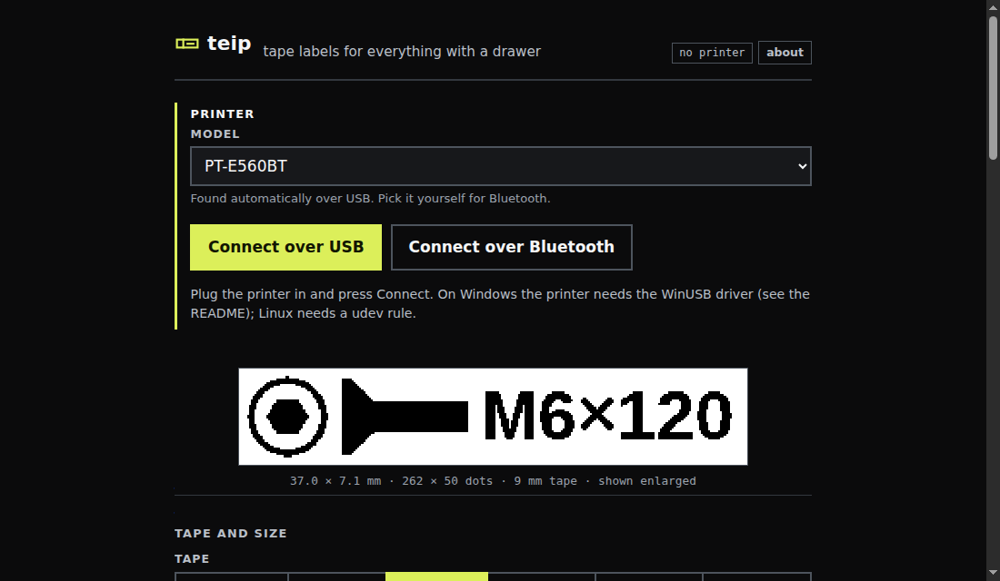

# Installing teip

The page is the same everywhere. What differs is who renders the label and talks to the printer.

| | Where it runs | Printer connection | Browsers |
|---|---|---|---|
| [**In the browser**](#in-the-browser) | the web page itself, nothing to install | USB (WebUSB) or Bluetooth (Web Serial) on the same computer | Chrome or Edge on a desktop |
| [**Raspberry Pi / Linux**](#raspberry-pi-or-any-linux-with-systemd) | a small always-on computer next to the printer | USB | any browser on your network, phones too |
| [**Windows**](#windows) | a Windows PC next to the printer | USB | any browser on your network |

When a teip server serves the page, the server renders and prints. When the page is opened on
its own, it loads the same Python label code into the browser ([Pyodide](https://pyodide.org),
about 15 MB on the first visit, cached after that) and talks to the printer directly.

> [!NOTE]
> Real labels so far: a PT-E560BT over USB, from the Windows server and from Chrome on Windows
> (WebUSB, WinUSB driver). The other routes are written but untested. See [printers.md](printers.md).

## In the browser

Open **[petrepa.com/teip](https://petrepa.com/teip/)** in Chrome or Edge, press
**Connect over USB** or **Connect over Bluetooth**, and print. Templates and history stay in
that browser.

- **Windows:** WebUSB can only reach the printer when it uses the WinUSB driver. Install it once
  with [Zadig](https://zadig.akeo.ie/) (Options → List All Devices → pick the printer → WinUSB →
  Replace Driver). Brother's own Windows driver and P-touch Editor stop seeing the printer
  after that. To undo it, uninstall the device in Device Manager (with its driver) and plug it back in.
- **Linux:** add the udev rule from [`deploy/linux/install.sh`](../deploy/linux/install.sh) so your
  user can open the device. If the kernel's `usblp` printer driver has claimed it, the browser
  cannot: `sudo rmmod usblp`, or blacklist it. (The teip server detaches it by itself.)
- **macOS:** should work as it is.
- **Bluetooth:** pair the printer with the computer first, then pick it from the list.
- Firefox, Safari and iPhones have neither WebUSB nor Web Serial. Use a teip server for those.

<p></p>

## Raspberry Pi (or any Linux with systemd)

A Pi Zero 2 W is plenty. With Raspberry Pi OS Lite on it and the printer plugged in:

```sh
sudo apt install -y git
git clone https://github.com/petrepa/teip && cd teip
./deploy/linux/install.sh --hostname teip
```

Then open **http://teip.local/** from any device on the network. The script:

- installs [uv](https://docs.astral.sh/uv/) and the Python environment (it fetches Python 3.12+ itself if the OS has an older one),
- finds the printer model on USB and writes `config.toml`,
- adds a udev rule so the service can use the printer without root,
- installs and starts a `teip` systemd service on port 80 that starts at boot and restarts if it stops,
- with `--hostname`, renames the machine so it answers as `teip.local`.

Update with `git pull && ./deploy/linux/install.sh`. Logs: `journalctl -u teip -f`.

Turn off **Auto Power Off** on the printer, or it disappears from USB after a while.

## Windows

```powershell
git clone https://github.com/petrepa/teip; cd teip
uv sync
copy config.example.toml config.toml     # set backend = "usb" and your printer
# elevated, once; needs NSSM (https://nssm.cc) on PATH or -Nssm C:\path\to\nssm.exe
powershell -ExecutionPolicy Bypass -File .\deploy\windows\install-service.ps1
```

The printer needs the WinUSB driver (Zadig, as above). The service listens on
`127.0.0.1:8014`; set `host = "0.0.0.0"` in `config.toml` to reach it from other devices, or
put a reverse proxy in front.

## Configuration

`config.toml` in the repo folder, or `TEIP_<KEY>` environment variables. See
[`config.example.toml`](../config.example.toml): printer model, `backend = "usb"` or `"mock"`
(writes PNGs and job files instead of printing), margins, Gridfinity lengths, font, host and port.
