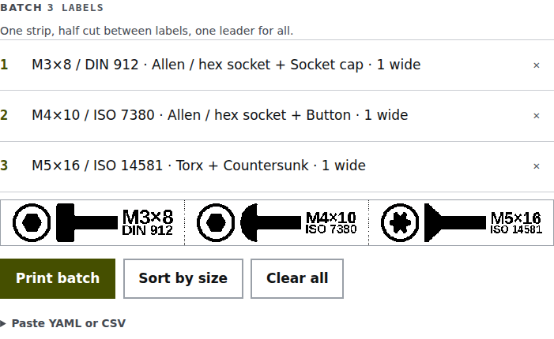
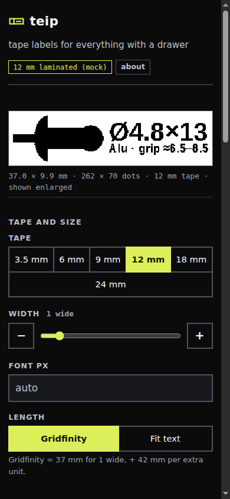

# Using teip

Pick what goes in the box, type the size, print. teip draws the label from parts you choose: the
drive and head of a screw, a nut, washer, rivet or insert, or any icon you add, next to one or two
lines of text. For common combinations it suggests the DIN/ISO number, one click to use it as the
second line.

<p></p>

## Strips, not single labels

Queue labels in **Batch** and print them as one strip. The printer half-cuts between them, so
they stay together on the backing and peel off one by one. Every print job wastes about 24 mm of
tape before the first label; a strip pays that once.

**Chain printing** keeps the last label inside the printer, so the next print does not waste a
leader either. Press the printer's Feed/Cut key to get it out.

<picture>
  <source media="(prefers-color-scheme: dark)" srcset="img/batch-dark.png">
  
</picture>

## Label length

- **Gridfinity:** in grid units, halves allowed. 37 mm for one unit and 42 mm per extra unit by
  default; set `gridfinity_base_mm` and `gridfinity_unit_mm` in `config.toml` to match your bins.
- **Fit text:** just long enough for the icons and text. Good for assortment boxes and drawers.
- A fixed length in mm through the batch format or the API (`length_mm`).

## Rivets

Pick type, material, diameter and length, and teip writes `Ø4.8×13` with the grip range
underneath, or the drill size for rivet nuts. Both lines stay editable.

## Batch from a spreadsheet

Open **Paste YAML or CSV** under the batch and paste rows. CSV needs a header:

```csv
icon,line1,line2,units
drive/hex-socket,M3×8,DIN 912,1
nuts/nyloc,M5,DIN 985,1
```

Columns are the label fields listed in [PROTOCOL.md](PROTOCOL.md): `line1`, `line2`, `icon` or
`icons`, `units`, `length_mm`, `tape_mm`, `font_size` and more.

## Templates and history

**Save template** keeps the current label under a name. **Recent prints** lists the last 30
prints; click one to load it, or reprint it as it was. On a teip server these are shared by
everyone who uses it; in the browser they stay in that browser.

## Your own icons

Drop black-on-white PNGs into any folder under `icons/`; they show up under **Other**, grouped by
folder. On a teip server you can also upload one from the page.

## On a phone

A teip server works from any phone browser on the same network, in light and dark.


